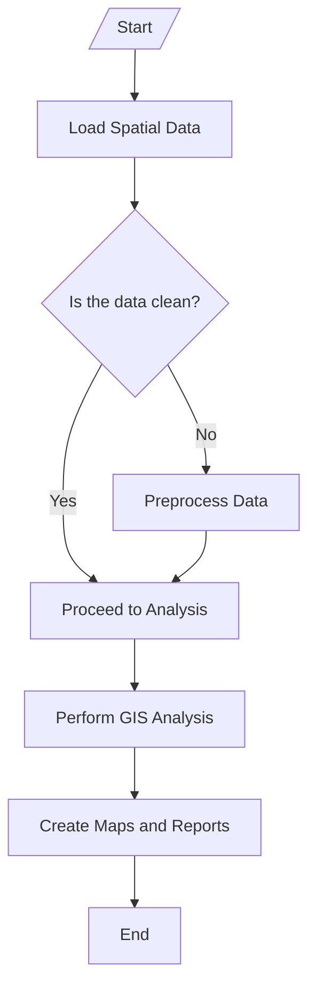
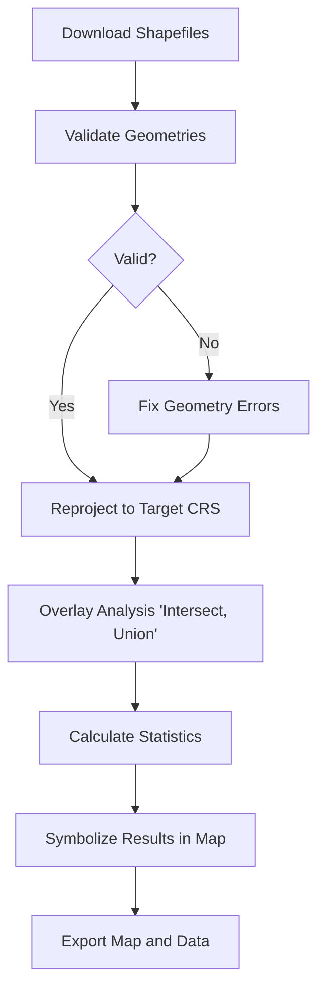
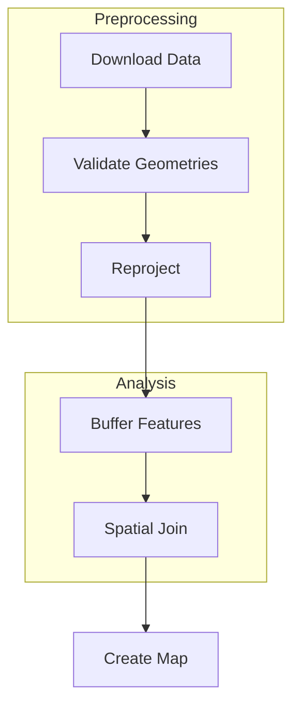
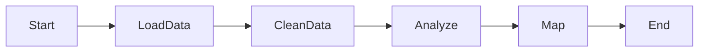

## 1. **What is Mermaid?**

Mermaid is a simple markdown-like language you can use to create diagrams and flowcharts from text.

It's perfect for GIS analysis workflows because you can **easily sketch processes** like:

- Data collection
- Data preprocessing
- Spatial analysis
- Visualization  
- Reporting
    

👉 You **write text** → **Mermaid renders diagrams**.

You can use Mermaid in:

- Markdown editors (like Obsidian, Typora)
    
- GitHub markdown
    
- Websites (with Mermaid.js)
    
- Tools like [Mermaid Live Editor](https://mermaid-js.github.io/mermaid-live-editor/)
    

---

## 2. **Basic Syntax for Flowcharts**

A simple **flowchart** in Mermaid uses `flowchart` keyword.

- `TD` = Top Down (flow vertically)
    
- `-->` = arrow
    
- `{}` = decision/condition node
    
- `[]` = regular step/action
    

---

## 3. **Example: Typical GIS Analysis Flow**

Imagine a **GIS analysis** where you:

- Download a shapefile
    
- Validate geometries
    
- Reproject
    
- Perform an overlay analysis
    
- Make a map
    

Here’s a Mermaid diagram for that:
flowchart TD

    A[Download Shapefiles] --> B[Validate Geometries]
    B --> C{Valid?}
    C -- No --> D[Fix Geometry Errors]
    C -- Yes --> E[Reproject to Target CRS]
    D --> E
    E --> F[Overlay Analysis (Intersect, Union)]
    F --> G[Calculate Statistics]
    G --> H[Symbolize Results in Map]
    H --> I[Export Map and Data]

---

## 4. **Some Tips for GIS Flows**

- Use **decisions** `{}` to model "if-else" situations (e.g., data valid or not).
    
- Group things using **subgraphs** if you want (e.g., "Preprocessing").
    

Example:

- Use different directions:
    
    - `TD` = top-down
        
    - `LR` = left-right
        
    - `BT` = bottom-top
        

Example:

---

## 5. **Common GIS Analysis Elements You Might Use**

|Mermaid Shape|Use Case in GIS|
|:--|:--|
|`[Text]`|Standard process step (e.g., "Reproject Data")|
|`{Question?}`|Decision point (e.g., "Valid Data?")|
|`((Circle))`|Special action like "Start" or "End"|
|`>Text]` or `[Text<`|Inputs/Outputs|

---

## 6. **Tools to Use Mermaid**

- [Mermaid Live Editor](https://mermaid-js.github.io/mermaid-live-editor/) (online)
- Obsidian (markdown + diagrams)
- GitHub markdown
- Jupyter notebooks (with Mermaid plugin)
    

---

# 🎯 **Summary: How to Start**

1. Think through the **GIS analysis steps** you want to visualize.
2. Go to  [Mermaid Live Editor](https://mermaid-js.github.io/mermaid-live-editor/) (online)
3. Start a Mermaid `flowchart TD` block.
4. Use arrows `-->` to show steps and decisions `{}` for checks.
5. Render it in a Mermaid-supported environment.
    

